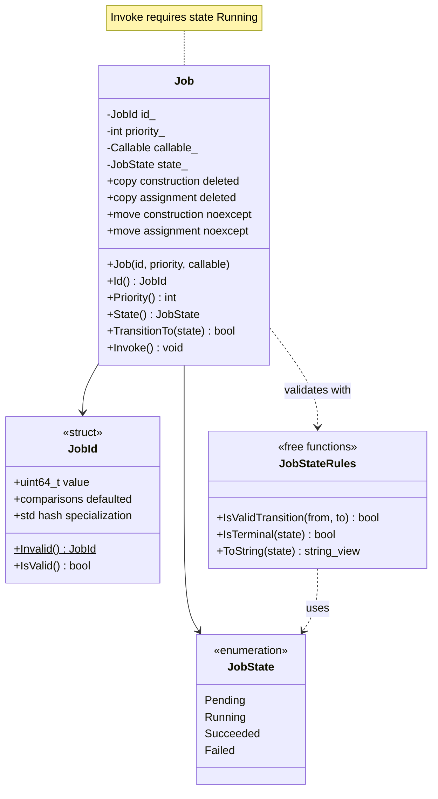
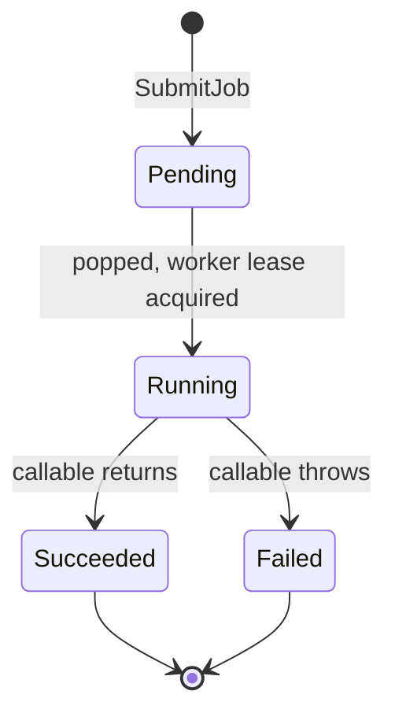
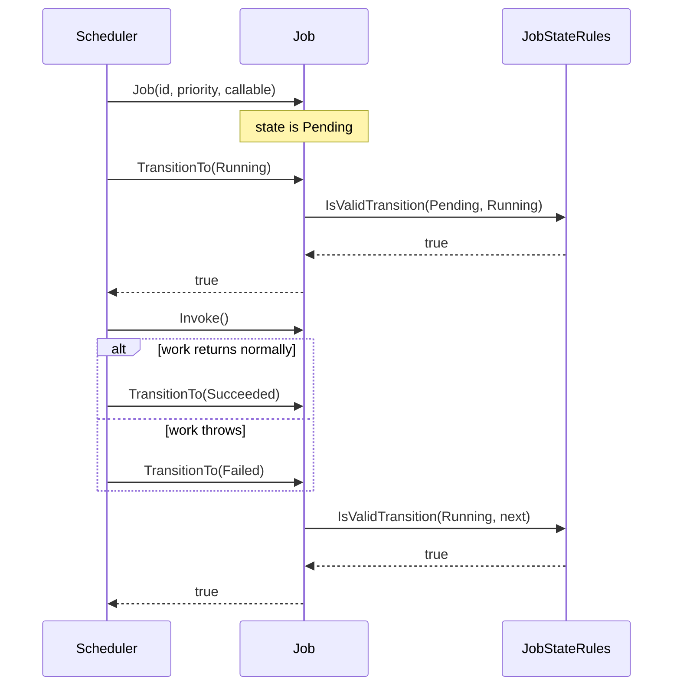

# Job and lifecycle states

## Class diagram

```mermaid
classDiagram
    class JobId {
        <<struct>>
        +uint64_t value
        +Invalid()$ JobId
        +IsValid() bool
        +comparisons defaulted
        +std hash specialization
    }
    class JobState {
        <<enumeration>>
        Pending
        Running
        Succeeded
        Failed
    }
    class JobStateRules {
        <<free functions>>
        +IsValidTransition(from, to) bool
        +IsTerminal(state) bool
        +ToString(state) string_view
    }
    class Job {
        -JobId id_
        -int priority_
        -Callable callable_
        -JobState state_
        +Job(id, priority, callable)
        +copy construction deleted
        +copy assignment deleted
        +move construction noexcept
        +move assignment noexcept
        +Id() JobId
        +Priority() int
        +State() JobState
        +TransitionTo(state) bool
        +Invoke() void
    }
    note for Job "Invoke requires state Running"
    Job --> JobId
    Job --> JobState
    Job ..> JobStateRules : validates with
    JobStateRules ..> JobState : uses
```

## State diagram

```mermaid
stateDiagram-v2
    [*] --> Pending: SubmitJob
    Pending --> Running: popped, worker lease acquired
    Running --> Succeeded: callable returns
    Running --> Failed: callable throws
    Succeeded --> [*]
    Failed --> [*]
```

## Sequence diagram: one job's life

```mermaid
sequenceDiagram
    participant S as Scheduler
    participant J as Job
    participant R as JobStateRules
    S->>J: Job(id, priority, callable)
    Note over J: state is Pending
    S->>J: TransitionTo(Running)
    J->>R: IsValidTransition(Pending, Running)
    R-->>J: true
    J-->>S: true
    S->>J: Invoke()
    alt work returns normally
        S->>J: TransitionTo(Succeeded)
    else work throws
        S->>J: TransitionTo(Failed)
    end
    J->>R: IsValidTransition(Running, next)
    R-->>J: true
    J-->>S: true
```